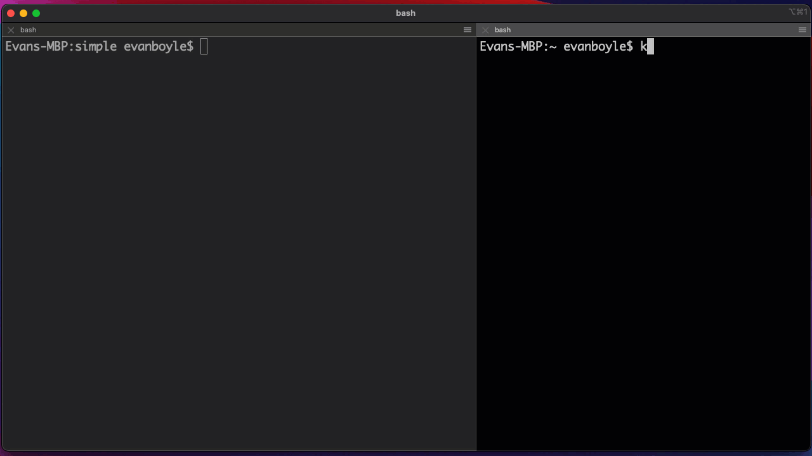

# pulumi-repl

Create cloud infrastructure and explore pulumi in an interactive NodeJS REPL.

[](https://npmjs.com/package/pulumi-repl)


1. Create and explore cloud infrastructure.
2. Run `apply` and experiment with other pulumi functionality.
3. Save your work as a full pulumi program when you're done with `eject`!
4. Create ephemeral sessions that automatically delete all resources on `ctrl+c`.

Just a few lines of code to get started:

```sh
yarn install pulumi-repl
```

```ts
import { PulumiRepl } from "pulumi-repl";

const repl = new PulumiRepl({
    stack: "dev",
    project: "pulumi-repl",
    eject: true, // save my work at the end in ./eject
    config: {
        "aws:region": { value: "us-west-2" }
    },
});

repl.start().catch(err => console.error(err));
```

## Demos

### Kubernetes

Create kubernetes resources interactively! At the end, all created resources are saved in stae by the pulumi engine.



### Eject

When you're done with your REPL, you can eject a pulumi program generated from all the commands you entered. Here we create a static S3 website. At the end our program is ejected in `./eject`. When we run a preview on that program, we see that there's no diff!


## Usage && Requirements

### Prereqs:

1. Pulumi CLI logged in and configured: https://www.pulumi.com/docs/get-started/
2. Cloud credentials configured as per above guide (for your cloud of choice).

### Basic

```ts
import { PulumiRepl } from "pulumi-repl";

// configure the REPL
const repl = new PulumiRepl({
    stack: "dev", // you Pulumi stack name, where your infrastructure state gets stored
    project: "pulumi-repl", // top level pulumi project
    config: { // any config that might be required by your cloud provider
        "aws:region": { value: "us-west-2" }
    },
});

// start execution, ctrl+c to exit
repl.start().catch(err => console.error(err));
```

### Registering Stack Outputs in the REPL

The REPL has a builtin function `registerOutput(k, v)` which creates stack exports.

```sh
$ pulumi-repl> registerOutput("websiteUrl", siteBucket.websiteEndpoint);

...
Outputs:
    websiteUrl: "s3-website-bucket-82db68d.s3-website-us-west-2.amazonaws.com"
```

### Eject
`eject` will output a full pulumi program into the `./eject` directory including:
- index.js (program)
- pacakge.json
- Pulumi.yaml (your project file)

```ts
const repl = new PulumiRepl({
    eject: true // save your work in ./eject at the end
    stack: "dev",
    project: "pulumi-repl",
    config: {
        "aws:region": { value: "us-west-2" }
    },
});

To run your program:
```sh
$ cd ./eject
$ yarn install
$ pulumi stack select # pick the stack you want to work with
$ pulumi config set ... # set any cloud provider config values if needed
$ pulumi preview # see your program in action
```

### Plugins and Context

The REPL comes preloaded with the following Pulumi provider plugins:

- AWS
- Azure (native)
- GCP 
- Kubernetes

You can add additional provider plugins and SDKs as described below.

The REPL supports defining context values via `this.addContext(k, v)`, which we use to load the `random` resource provider SDK below. In addition, we access the Automation API stack object to install plugins.

```ts
import { PulumiRepl } from "pulumi-repl";
// import a custom pulumi provider SDK.
import * as random from "@pulumi/random";

const repl = new PulumiRepl({
    stack: "dev",
    project: "pulumi-repl-custom",
});

// make the random SDK accessible to the repl at runtime
repl.addContext("random", random);

// access the automation api stack to install provider plugins
repl.stack.then(s => {
    // install the 'random' resource provider plugin
    s.workspace.installPlugin("random", "v4.0.0").then(()=>{
        repl.start().catch(err => console.error(err));
    })
});
```

### Ephemeral Stacks

Specify the `ephemeral: true` arg to run the repl in ephemeral mode. On `ctrl+c` all of your cloud resources will be cleaned up and destroyed.

```ts
import { PulumiRepl } from "pulumi-repl";

const repl = new PulumiRepl({
    stack: "dev",
    project: "pulumi-repl-custom",
    ephemeral: true // delete the resources created during this session with ctrl+c
});
```

### Automation API Stack & Workspace
If you're an advanced Pulumi user, you may want to access the Automation API Stack. You can do this via `this.stack` (a promise). 

You can access the underlying `LocalWorkspace` via `this.stack.then(s => s.workspace)`. 

Advanced workspace configuration options are available including custom backends (azure, filestate, etc), and custom secrets providers via `ReplArgs.workspaceOpts`
## How it works

This library uses the native NodeJS REPL library and the [Pulumi Automation API](https://www.pulumi.com/docs/guides/automation-api/) (OSS) which turns the Pulumi IaC engine into an embeddable SDK. 

### Caveats & Immutability

When you execute commands in the REPL, you're still running pulumi code. Because Pulumi is declarative and desired state, resources can't be mutated after they are instantiated in the REPL. You'll have to exit the session and restart to "make an edit". Each REPL session will compute differences against the previous state. If you define a resource in one session and then forget it in the next one, it will be deleted. This is just like making edits and running a normal pulumi program, the only difference is that we get to create resources incrementally and explore their shape, outputs, etc.

Read more about Pulumi's desired state architecture: https://www.pulumi.com/docs/intro/concepts/how-pulumi-works/
